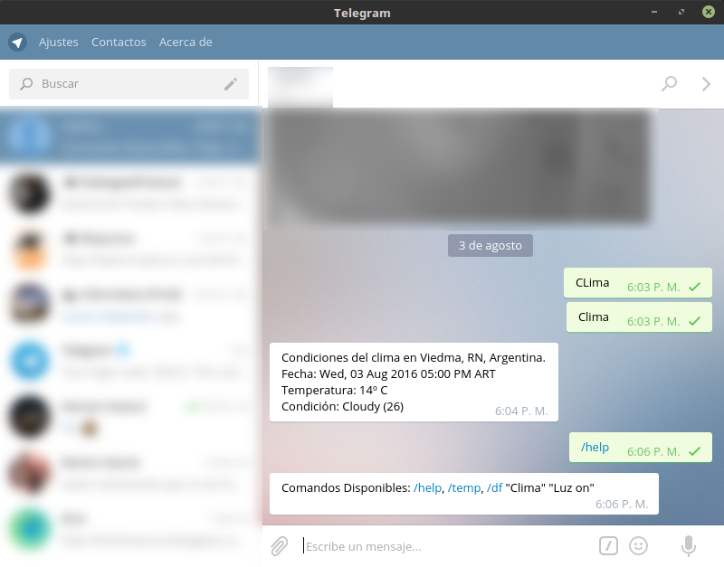

Bot telegram para controlar Raspberry Pi 3
---

Programando un ***Bot para Telegram*** que hará un par de cosas por nosotros.

En principio, programaré un bot con el que pueda encender y apagar una lámpara, [la misma que puedo controlar mediante voz](https://github.com/ejmalfatti/VoiceControl-RaspberryPi), envíandole un comando desde cualquiera de sus formas, desde la aplicación de telegram para Android/iOS, web o de escritorio.

También voy agregar una parte de código de [este repositorio](https://github.com/ejmalfatti/clima-python) que obtiene información del pronóstico para que el bot me envie cuando se lo pregunte.

Recuerde que se irá actualizando este código y agregando nuevas funcionalidades.

**[Archivos y código en el repositorio github](https://github.com/ejmalfatti/telegramBot)**.

**Screenshot:**

***Para un futuro:*** Obtener algunas informaciones del **Raspberry Pi 3** y para pedirle que me envíe una foto de la cámara de seguridad de mi hogar y también que pueda enviarme una secuenci de fotos, número no definido por ahora.